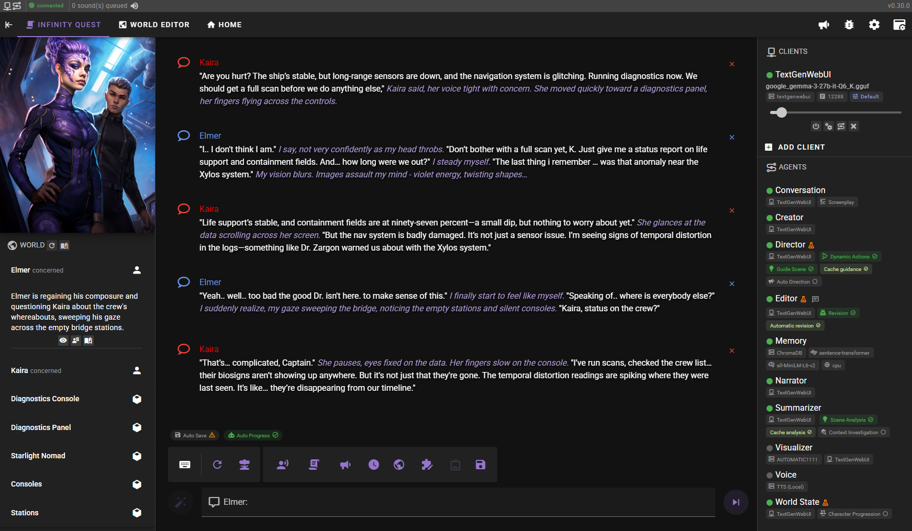
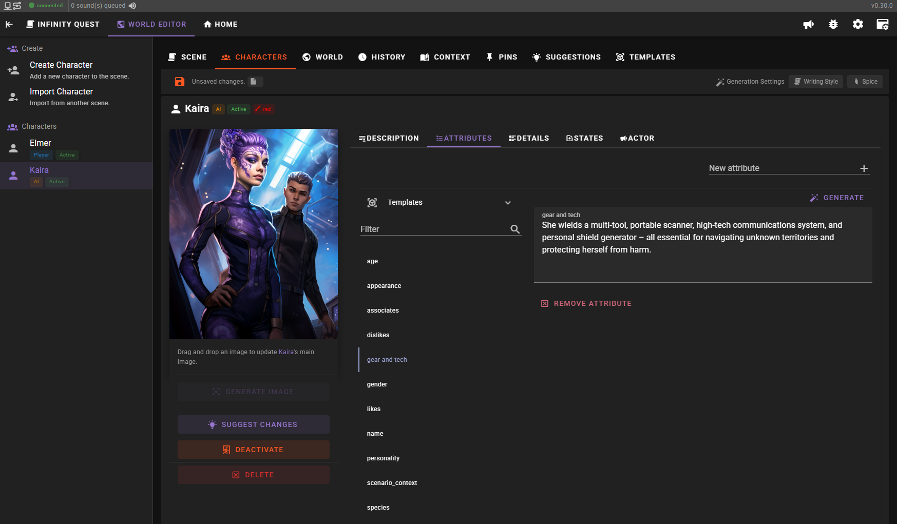
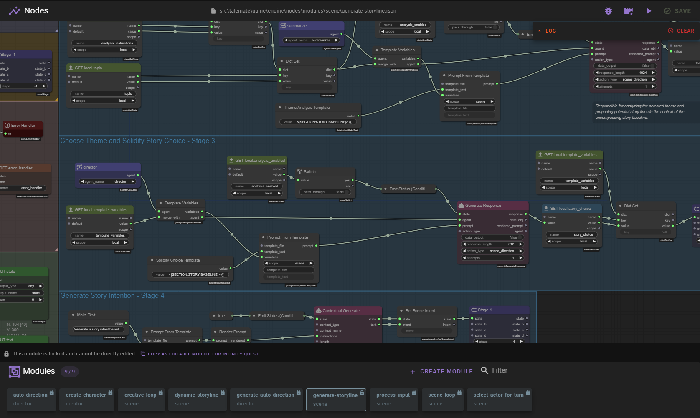
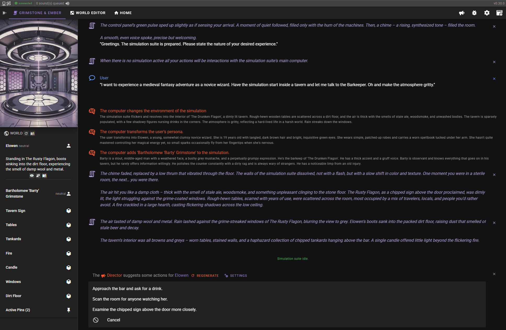

# Talemate

Roleplay with AI with a focus on strong narration and consistent world and game state tracking.

### Comes with the following additions:

---

Narrative Omniscience Disable Editor Step: Runs character messages through editor step which removes content other characters cannot perceive (thoughts, secrets, etc). Produces two message versions: character's own message with private info and public message with removed private info (public one is shown to other characters in their own prompts).

Character Dependent History: Located in scene settings page. Makes it so characters only have access to messages and history they were available for (deactivated, in another room, etc).

LLM Client Updates: Updates to Claude, Gemini, Deepseek, and GLM/ZAI client types to allow streaming, coercion, and latest models.

Individual coercion: Added individual coercion fields for every agent type for each LLM Client.

Custom Editor Steps: Added ability to add custom editor steps that runs between message step and narrative omniscience disable step.

Various Character Additions: Added public/private/self data (other characters cannot see a private data of another character unless allowed, self values are only shown to own character), state reinforcement improvements (priority values, countdown only on character turn now, run before or after character turn, etc).

Better Scene Viewing: Added 'all scenes' page to be able to browse all previously imported scenes.

Import SillyTavern lorebooks: Can now import lorebooks into scene in world tab, and also exclude specific characters from seeing them.

Character Management: Can group characters so they only make 1 LLM call instead of multiple; can put characters into separate rooms where they talk on their own without access to user; can import a character with their history from their previous scene now.

Recommended to use Deepseek and GLM-5.2. This repo has client settings already built in for ease of usage, but they can be modified easily. For narrative omniscience disable in the editor, I recommend using Gemma 4 31B whether through OpenRouter, Google AI Studio API, or llamacpp to get the best results as it seems to understand the task the best.

---

|||
|------------------------------------------|------------------------------------------|
|||

## Core Features

- Multiple agents for dialogue, narration, summarization, direction, editing, world state management, character/scenario creation, text-to-speech, and visual generation
- Supports per agent API selection
- Long-term memory and passage of time tracking
- Narrative world state management to reinforce character and world truths
- Creative tools for managing NPCs, AI-assisted character, and scenario creation with template support
- Node editor for creating complex scenarios and re-usable modules
- Context management for character details, world information, past events, and pinned information
- Customizable templates for all prompts using Jinja2
- Modern, responsive UI

## Documentation

- [Installation and Getting started](https://vegu-ai.github.io/talemate/)
- [User Guide](https://vegu-ai.github.io/talemate/user-guide/interacting/)

## Discord Community

Need help? Join the new [Discord community](https://discord.gg/8bGNRmFxMj)

## Supported APIs

- [OpenAI](https://platform.openai.com/overview)
- [Anthropic](https://www.anthropic.com/)
- [mistral.ai](https://mistral.ai/)
- [Cohere](https://www.cohere.com/)
- [Groq](https://www.groq.com/)
- [Google Gemini](https://console.cloud.google.com/)
- [OpenRouter](https://openrouter.ai/)

Supported self-hosted APIs:
- [KoboldCpp](https://koboldai.org/cpp) ([Local](https://koboldai.org/cpp), [Runpod](https://koboldai.org/runpodcpp), [VastAI](https://koboldai.org/vastcpp), also includes image gen support)
- [oobabooga/text-generation-webui](https://github.com/oobabooga/text-generation-webui) (local or with runpod support)
- [LMStudio](https://lmstudio.ai/)
- [TabbyAPI](https://github.com/theroyallab/tabbyAPI/)
- [Ollama](https://ollama.com/)

Generic OpenAI api implementations (tested and confirmed working):
- [DeepInfra](https://deepinfra.com/)
- [llamacpp](https://github.com/ggerganov/llama.cpp) with the `api_like_OAI.py` wrapper
- let me know if you have tested any other implementations and they failed / worked or landed somewhere in between
